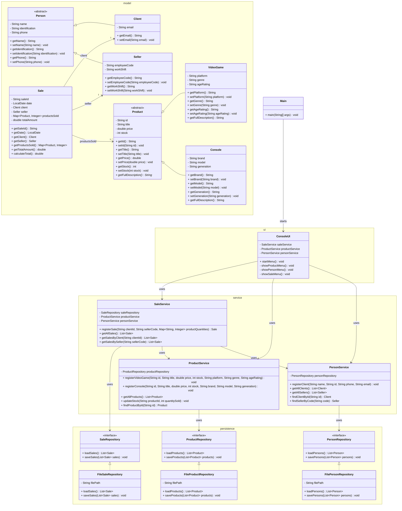

```mermaid
classDiagram
    direction TB
    
    namespace model {
        class Person {
            <<abstract>>
            - String name
            - String identification
            - String phone
            + getName() String
            + setName(String name) void
            + getIdentification() String
            + setIdentification(String identification) void
            + getPhone() String
            + setPhone(String phone) void
        }

        class Client {
            - String email
            + getEmail() String
            + setEmail(String email) void
        }

        class Seller {
            - String employeeCode
            - String workShift
            + getEmployeeCode() String
            + setEmployeeCode(String employeeCode) void
            + getWorkShift() String
            + setWorkShift(String workShift) void
        }

        class Product {
            <<abstract>>
            - String id
            - String title
            - double price
            - int stock
            + getId() String
            + setId(String id) void
            + getTitle() String
            + setTitle(String title) void
            + getPrice() double
            + setPrice(double price) void
            + getStock() int
            + setStock(int stock) void
            + getFullDescription()* String
        }

        class VideoGame {
            - String platform
            - String genre
            - String ageRating
            + getPlatform() String
            + setPlatform(String platform) void
            + getGenre() String
            + setGenre(String genre) void
            + getAgeRating() String
            + setAgeRating(String ageRating) void
            + getFullDescription() String
        }

        class Console {
            - String brand
            - String model
            - String generation
            + getBrand() String
            + setBrand(String brand) void
            + getModel() String
            + setModel(String model) void
            + getGeneration() String
            + setGeneration(String generation) void
            + getFullDescription() String
        }

        class Sale {
            - String saleId
            - LocalDate date
            - Client client
            - Seller seller
            - Map~Product, Integer~ productsSold
            - double totalAmount
            + getSaleId() String
            + getDate() LocalDate
            + getClient() Client
            + getSeller() Seller
            + getProductsSold() Map~Product, Integer~
            + getTotalAmount() double
            + calculateTotal() double
        }
    }

    namespace persistence {
        class PersonRepository {
            <<interface>>
            + loadPersons() List~Person~
            + savePersons(List~Person~ persons) void
        }

        class FilePersonRepository {
            - String filePath
            + loadPersons() List~Person~
            + savePersons(List~Person~ persons) void
        }

        class ProductRepository {
            <<interface>>
            + loadProducts() List~Product~
            + saveProducts(List~Product~ products) void
        }

        class FileProductRepository {
            - String filePath
            + loadProducts() List~Product~
            + saveProducts(List~Product~ products) void
        }

        class SaleRepository {
            <<interface>>
            + loadSales() List~Sale~
            + saveSales(List~Sale~ sales) void
        }

        class FileSaleRepository {
            - String filePath
            + loadSales() List~Sale~
            + saveSales(List~Sale~ sales) void
        }
    }

    namespace service {
        class PersonService {
            - PersonRepository personRepository
            + registerClient(String name, String id, String phone, String email) void
            + getAllClients() List~Client~
            + getAllSellers() List~Seller~
            + findClientById(String id) Client
            + findSellerByCode(String code) Seller
        }

        class ProductService {
            - ProductRepository productRepository
            + registerVideoGame(String id, String title, double price, int stock, String platform, String genre, String ageRating) void
            + registerConsole(String id, String title, double price, int stock, String brand, String model, String generation) void
            + getAllProducts() List~Product~
            + updateStock(String productId, int quantitySold) void
            + findProductById(String id) Product
        }

        class SaleService {
            - SaleRepository saleRepository
            - ProductService productService
            - PersonService personService
            + registerSale(String clientId, String sellerCode, Map~String, Integer~ productQuantities) Sale
            + getAllSales() List~Sale~
            + getSalesByClient(String clientId) List~Sale~
            + getSalesBySeller(String sellerCode) List~Sale~
        }
    }

    namespace ui {
        class ConsoleUI {
            - SaleService saleService
            - ProductService productService
            - PersonService personService
            + startMenu() void
            - showProductMenu() void
            - showPersonMenu() void
            - showSaleMenu() void
        }
    }

    class Main {
        + main(String[] args) void
    }

    Person <|-- Client
    Person <|-- Seller
    Product <|-- VideoGame
    Product <|-- Console

    PersonRepository <|.. FilePersonRepository
    ProductRepository <|.. FileProductRepository
    SaleRepository <|.. FileSaleRepository

    Sale --> "1" Client : client
    Sale --> "1" Seller : seller
    Sale --> "1..*" Product : productsSold

    PersonService --> PersonRepository : uses
    ProductService --> ProductRepository : uses
    SaleService --> SaleRepository : uses
    SaleService --> ProductService : uses
    SaleService --> PersonService : uses

    ConsoleUI --> SaleService : uses
    ConsoleUI --> ProductService : uses
    ConsoleUI --> PersonService : uses
    Main --> ConsoleUI : starts
```