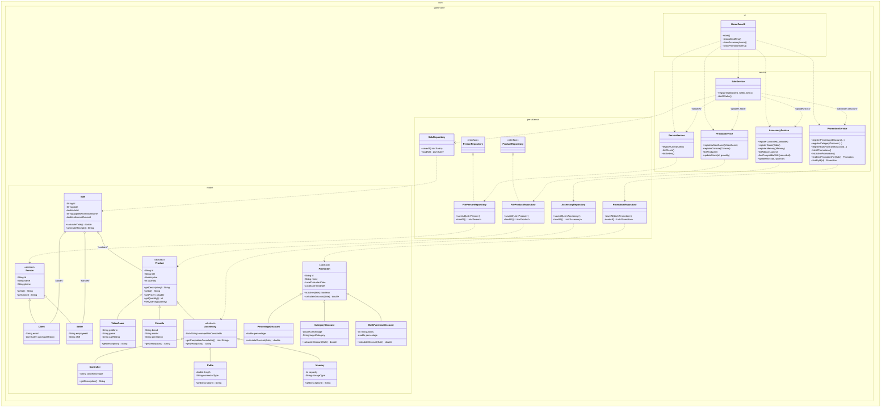

```mermaid
classDiagram
    direction TB

   
    namespace com.gamezone.model {
        class Person {
            <<abstract>>
            -String id
            -String name
            -String phone
            +getId() String
            +getName() String
        }
        
        class Client {
            -String email
            -List~Sale~ purchaseHistory
        }
        
        class Seller {
            -String employeeId
            -String shift
        }

        class Product {
            <<abstract>>
            -String id
            -String title
            -double price
            -int quantity
            +getDescription()* String
            +getId() String
            +getPrice() double
            +getQuantity() int
            +setQuantity(quantity)
        }

        class VideoGame {
            -String platform
            -String genre
            -String ageRating
            +getDescription() String
        }

        class Console {
            -String brand
            -String model
            -String generation
            +getDescription() String
        }

        class Accessory {
            <<abstract>>
            -List~String~ compatibleConsoleIds
            +getCompatibleConsoleIds() List~String~
            +getDescription()* String
        }

        class Controller {
            -String connectionType
            +getDescription() String
        }

        class Cable {
            -double length
            -String connectorType
            +getDescription() String
        }

        class Memory {
            -int capacity
            -String storageType
            +getDescription() String
        }

        class Sale {
            -String id
            -String date
            -double total
            -String appliedPromotionName
            -double discountAmount
            +calculateTotal() double
            +generateReceipt() String
        }

        class Promotion {
            <<abstract>>
            -String id
            -String name
            -LocalDate startDate
            -LocalDate endDate
            +isActive(date) boolean
            +calculateDiscount(Sale)* double
        }

        class PercentageDiscount {
            -double percentage
            +calculateDiscount(Sale) double
        }

        class CategoryDiscount {
            -double percentage
            -String targetCategory
            +calculateDiscount(Sale) double
        }

        class BulkPurchaseDiscount {
            -int minQuantity
            -double percentage
            +calculateDiscount(Sale) double
        }
    }

    
    namespace com.gamezone.persistence {
        class PersonRepository {
            <<interface>>
        }
        class FilePersonRepository {
            +saveAll(List~Person~)
            +loadAll() List~Person~
        }
        class ProductRepository {
            <<interface>>
        }
        class FileProductRepository {
            +saveAll(List~Product~)
            +loadAll() List~Product~
        }
        class SaleRepository {
            +saveAll(List~Sale~)
            +loadAll() List~Sale~
        }
        class AccessoryRepository {
            +saveAll(List~Accessory~)
            +loadAll() List~Accessory~
        }
        class PromotionRepository {
            +saveAll(List~Promotion~)
            +loadAll() List~Promotion~
        }
    }

   
    namespace com.gamezone.service {
        class PersonService {
            +registerClient(Client)
            +listClients()
            +listSellers()
        }
        class ProductService {
            +registerVideoGame(VideoGame)
            +registerConsole(Console)
            +listProducts()
            +updateStock(id, quantity)
        }
        class AccessoryService {
            +registerController(Controller)
            +registerCable(Cable)
            +registerMemory(Memory)
            +listAllAccessories()
            +findCompatibleWith(consoleId)
            +updateStock(id, quantity)
        }
        class PromotionService {
            +registerPercentageDiscount(...)
            +registerCategoryDiscount(...)
            +registerBulkPurchaseDiscount(...)
            +listAllPromotions()
            +listActivePromotions()
            +findBestPromotionFor(Sale) Promotion
            +findById(id) Promotion
        }
        class SaleService {
            +registerSale(Client, Seller, items)
            +listAllSales()
        }
    }

   
    namespace com.gamezone.ui {
        class GameZoneUI {
            +start()
            -showMainMenu()
            -showAccessoryMenu()
            -showPromotionMenu()
        }
    }

    
    Person <|-- Client
    Person <|-- Seller

    Product <|-- VideoGame
    Product <|-- Console
    Product <|-- Accessory

    Accessory <|-- Controller
    Accessory <|-- Cable
    Accessory <|-- Memory

    Promotion <|-- PercentageDiscount
    Promotion <|-- CategoryDiscount
    Promotion <|-- BulkPurchaseDiscount

    PersonRepository <|.. FilePersonRepository
    ProductRepository <|.. FileProductRepository

   
    Sale o-- Client : "places"
    Sale o-- Seller : "handles"
    Sale o-- Product : "contains"

   
    GameZoneUI ..> PersonService
    GameZoneUI ..> ProductService
    GameZoneUI ..> SaleService
    GameZoneUI ..> AccessoryService
    GameZoneUI ..> PromotionService

   
    SaleService ..> PersonService : "validates"
    SaleService ..> ProductService : "updates stock"
    SaleService ..> AccessoryService : "updates stock"
    SaleService ..> PromotionService : "calculates discount"
    SaleService ..> SaleRepository

    PersonService ..> FilePersonRepository
    ProductService ..> FileProductRepository
    AccessoryService ..> AccessoryRepository
    PromotionService ..> PromotionRepository


    FilePersonRepository ..> Person
    FileProductRepository ..> Product
    AccessoryRepository ..> Accessory
    PromotionRepository ..> Promotion
    SaleRepository ..> Sale
```
