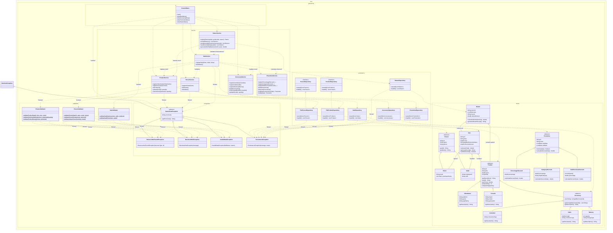

```mermaid
classDiagram
direction TB

    namespace com.gamezone.exceptions {
        class GameZoneException {
            <<abstract>>
            -String errorCode
            +getErrorCode() String
        }

        class ResourceNotFoundException {
            +ResourceNotFoundException(resourceType, id)
        }

        class BusinessRuleException {
            +BusinessRuleException(message)
        }

        class InvalidDataException {
            +InvalidDataException(fieldName, reason)
        }

        class PersistenceException {
            +PersistenceException(message, cause)
        }
    }

    namespace com.gamezone.validation {
        class ProductValidator {
            +validateProductData(id, title, price, stock)$
            +validateStockAvailability(product, requestedQuantity)$
            +validateProductExists(product, productId)$
        }

        class PersonValidator {
            +validatePersonData(id, name, email, phone)$
            +validatePersonExists(person, personId)$
            +validateUniquePerson(existing, newId)$
        }

        class SaleValidator {
            +validateSaleData(customer, seller, products)$
            +validateSaleExists(sale, saleId)$
        }
    }

    namespace com.gamezone.model {
        class Person {
            <<abstract>>
            -String id
            -String name
            -String phone
            +getId() String
            +getName() String
        }

        class Client {
            -String email
            -List~Sale~ purchaseHistory
        }

        class Seller {
            -String employeeId
            -String shift
        }

        class Product {
            <<abstract>>
            -String id
            -String title
            -double price
            -int quantity
            +getDescription()* String
            +getId() String
            +getPrice() double
            +getQuantity() int
            +setQuantity(quantity)
        }

        class VideoGame {
            -String platform
            -String genre
            -String ageRating
            +getDescription() String
        }

        class Console {
            -String brand
            -String model
            -String generation
            +getDescription() String
        }

        class Accessory {
            <<abstract>>
            -List~String~ compatibleConsoleIds
            +getCompatibleConsoleIds() List~String~
            +getDescription()* String
        }

        class Controller {
            -String connectionType
            +getDescription() String
        }

        class Cable {
            -double length
            -String connectorType
            +getDescription() String
        }

        class Memory {
            -int capacity
            -String storageType
            +getDescription() String
        }

        class Sale {
            -String id
            -String date
            -double total
            -String appliedPromotionName
            -double discountAmount
            +calculateTotal() double
            +generateReceipt() String
            +canBeReturned() boolean
        }

        class Promotion {
            <<abstract>>
            -String id
            -String name
            -LocalDate startDate
            -LocalDate endDate
            +isActive(date) boolean
            +calculateDiscount(Sale)* double
        }

        class PercentageDiscount {
            -double percentage
            +calculateDiscount(Sale) double
        }

        class CategoryDiscount {
            -double percentage
            -String targetCategory
            +calculateDiscount(Sale) double
        }

        class BulkPurchaseDiscount {
            -int minQuantity
            -double percentage
            +calculateDiscount(Sale) double
        }

        class Return {
            -String returnId
            -LocalDate date
            -String reason
            -double refundAmount
            +calculateRefundAmount() double
            +generateReturnReceipt() String
        }
    }

    namespace com.gamezone.persistence {
        class PersonRepository {
            <<interface>>
            +saveAll(List~Person~)
            +loadAll() List~Person~
        }
        class FilePersonRepository {
            +saveAll(List~Person~)
            +loadAll() List~Person~
        }
        class ProductRepository {
            <<interface>>
            +saveAll(List~Product~)
            +loadAll() List~Product~
        }
        class FileProductRepository {
            +saveAll(List~Product~)
            +loadAll() List~Product~
        }
        class SaleRepository {
            +saveAll(List~Sale~)
            +loadAll() List~Sale~
        }
        class AccessoryRepository {
            +saveAll(List~Accessory~)
            +loadAll() List~Accessory~
        }
        class PromotionRepository {
            +saveAll(List~Promotion~)
            +loadAll() List~Promotion~
        }
        class ReturnRepository {
            +saveAll(List~Return~)
            +loadAll() List~Return~
        }
    }

    namespace com.gamezone.service {
        class PersonService {
            +registerClient(Client)
            +listClients()
            +listSellers()
        }
        class ProductService {
            +registerVideoGame(VideoGame)
            +registerConsole(Console)
            +listProducts()
            +updateStock(id, quantity)
            +restoreStock(productId, quantity)
        }
        class AccessoryService {
            +registerController(Controller)
            +registerCable(Cable)
            +registerMemory(Memory)
            +listAllAccessories()
            +findCompatibleWith(consoleId)
            +updateStock(id, quantity)
        }
        class PromotionService {
            +registerPercentageDiscount(...)
            +registerCategoryDiscount(...)
            +registerBulkPurchaseDiscount(...)
            +listAllPromotions()
            +listActivePromotions()
            +findBestPromotionFor(Sale) Promotion
            +findById(id) Promotion
        }
        class SaleService {
            +registerSale(Client, Seller, items)
            +listAllSales()
        }
        class ReturnService {
            +registerReturn(saleId, productIds, reason) Return
            +viewAllReturns() List~Return~
            +viewReturnsByCustomer(customerId) List~Return~
            +viewReturnsBySale(saleId) List~Return~
            +generateMonthlyBalance(month, year) double
        }
    }

    namespace com.gamezone.ui {
        class ConsoleMenu {
            +start()
            -showMainMenu()
            -showAccessoryMenu()
            -showPromotionMenu()
            -showReturnMenu()
        }
    }

    %% Exception Hierarchy
    RuntimeException <|-- GameZoneException
    GameZoneException <|-- ResourceNotFoundException
    GameZoneException <|-- BusinessRuleException
    GameZoneException <|-- InvalidDataException
    GameZoneException <|-- PersistenceException

    %% Model Inheritance
    Person <|-- Client
    Person <|-- Seller

    Product <|-- VideoGame
    Product <|-- Console
    Product <|-- Accessory

    Accessory <|-- Controller
    Accessory <|-- Cable
    Accessory <|-- Memory

    Promotion <|-- PercentageDiscount
    Promotion <|-- CategoryDiscount
    Promotion <|-- BulkPurchaseDiscount

    %% Persistence Implementation
    PersonRepository <|.. FilePersonRepository
    ProductRepository <|.. FileProductRepository

    %% Model Relationships
    Sale o-- Client : "places"
    Sale o-- Seller : "handles"
    Sale o-- Product : "contains"

    Return o-- Sale : "references"
    Return o-- Product : "contains partial"

    %% UI to Service
    ConsoleMenu ..> PersonService
    ConsoleMenu ..> ProductService
    ConsoleMenu ..> SaleService
    ConsoleMenu ..> AccessoryService
    ConsoleMenu ..> PromotionService
    ConsoleMenu ..> ReturnService

    %% UI to Exception Hierarchy (Catching specific exceptions)
    ConsoleMenu ..> GameZoneException : "catches"

    %% Service to Validation Layer
    ProductService ..> ProductValidator : "invokes"
    PersonService ..> PersonValidator : "invokes"
    SaleService ..> SaleValidator : "invokes"

    %% Validation Layer throwing Exceptions
    ProductValidator ..> InvalidDataException : "throws"
    ProductValidator ..> BusinessRuleException : "throws"
    ProductValidator ..> ResourceNotFoundException : "throws"

    PersonValidator ..> InvalidDataException : "throws"
    PersonValidator ..> BusinessRuleException : "throws"
    PersonValidator ..> ResourceNotFoundException : "throws"

    SaleValidator ..> InvalidDataException : "throws"
    SaleValidator ..> BusinessRuleException : "throws"
    SaleValidator ..> ResourceNotFoundException : "throws"

    %% Services throwing Exceptions
    ProductService ..> GameZoneException : "throws"
    PersonService ..> GameZoneException : "throws"
    SaleService ..> GameZoneException : "throws"

    %% Service Inter-Dependencies
    SaleService ..> PersonService : "validates"
    SaleService ..> ProductService : "updates stock"
    SaleService ..> AccessoryService : "updates stock"
    SaleService ..> PromotionService : "calculates discount"
    SaleService ..> SaleRepository

    ReturnService ..> SaleService : "validates time/existence"
    ReturnService ..> ProductService : "restores stock"
    ReturnService ..> ReturnRepository

    %% Service to Persistence
    PersonService ..> FilePersonRepository
    ProductService ..> FileProductRepository
    AccessoryService ..> AccessoryRepository
    PromotionService ..> PromotionRepository

    %% Repositories throwing PersistenceException
    FilePersonRepository ..> PersistenceException : "throws"
    FileProductRepository ..> PersistenceException : "throws"
    SaleRepository ..> PersistenceException : "throws"
    AccessoryRepository ..> PersistenceException : "throws"
    PromotionRepository ..> PersistenceException : "throws"
    ReturnRepository ..> PersistenceException : "throws"

    %% Persistence to Model
    FilePersonRepository ..> Person
    FileProductRepository ..> Product
    AccessoryRepository ..> Accessory
    PromotionRepository ..> Promotion
    SaleRepository ..> Sale
    ReturnRepository ..> Return
```
