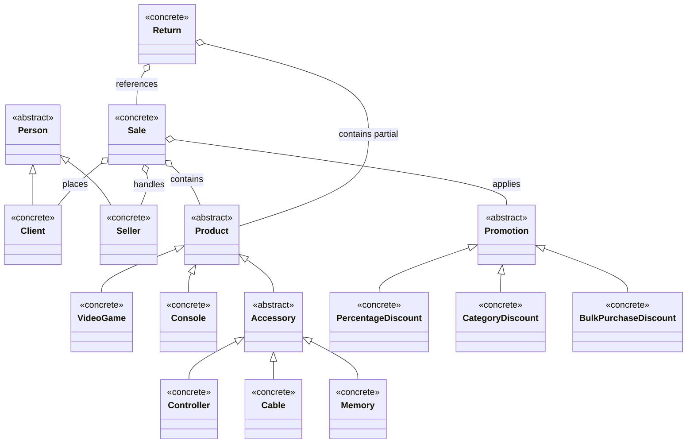

```mermaid

classDiagram
    direction TB

    %% ==========================================
    %% 1. PERSON HIERARCHY
    %% ==========================================
    class Person {
        <<abstract>>
    }
    class Client {
        <<concrete>>
    }
    class Seller {
        <<concrete>>
    }

    %% ==========================================
    %% 2. PRODUCT & ACCESSORY HIERARCHY (Req 1)
    %% ==========================================
    class Product {
        <<abstract>>
    }
    class VideoGame {
        <<concrete>>
    }
    class Console {
        <<concrete>>
    }

    class Accessory {
        <<abstract>>
    }
    class Controller {
        <<concrete>>
    }
    class Cable {
        <<concrete>>
    }
    class Memory {
        <<concrete>>
    }

    %% ==========================================
    %% 3. PROMOTION HIERARCHY (Req 2)
    %% ==========================================
    class Promotion {
        <<abstract>>
    }
    class PercentageDiscount {
        <<concrete>>
    }
    class CategoryDiscount {
        <<concrete>>
    }
    class BulkPurchaseDiscount {
        <<concrete>>
    }

    %% ==========================================
    %% 4. TRANSACTION & RETURN MODULE (Req 3)
    %% ==========================================
    class Sale {
        <<concrete>>
    }
    class Return {
        <<concrete>>
    }

    %% ==========================================
    %% INHERITANCE RELATIONSHIPS
    %% ==========================================

    %% Person Branch
    Person <|-- Client
    Person <|-- Seller

    %% Product Base Branch
    Product <|-- VideoGame
    Product <|-- Console
    Product <|-- Accessory

    %% Accessory Sub-Branch
    Accessory <|-- Controller
    Accessory <|-- Cable
    Accessory <|-- Memory

    %% Promotion Branch
    Promotion <|-- PercentageDiscount
    Promotion <|-- CategoryDiscount
    Promotion <|-- BulkPurchaseDiscount

    %% ==========================================
    %% ASSOCIATION & AGGREGATION RELATIONSHIPS
    %% ==========================================

    %% Sale Connections
    Sale o-- Client : places
    Sale o-- Seller : handles
    Sale o-- Product : contains
    Sale o-- Promotion : applies

    %% Return Connections
    Return o-- Sale : references
    Return o-- Product : contains partial
```
