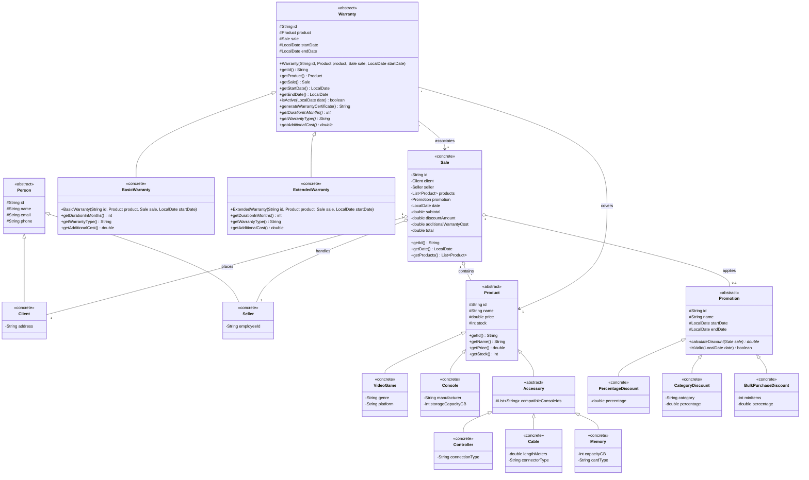

```mermaid
classDiagram
    direction TB

    %% ==========================================
    %% 1. PERSON HIERARCHY
    %% ==========================================
    class Person {
        <<abstract>>
        #String id
        #String name
        #String email
        #String phone
    }
    class Client {
        <<concrete>>
        -String address
    }
    class Seller {
        <<concrete>>
        -String employeeId
    }

    %% ==========================================
    %% 2. PRODUCT & ACCESSORY HIERARCHY
    %% ==========================================
    class Product {
        <<abstract>>
        #String id
        #String name
        #double price
        #int stock
        +getId() String
        +getName() String
        +getPrice() double
        +getStock() int
    }
    class VideoGame {
        <<concrete>>
        -String genre
        -String platform
    }
    class Console {
        <<concrete>>
        -String manufacturer
        -int storageCapacityGB
    }

    class Accessory {
        <<abstract>>
        #List~String~ compatibleConsoleIds
    }
    class Controller {
        <<concrete>>
        -String connectionType
    }
    class Cable {
        <<concrete>>
        -double lengthMeters
        -String connectorType
    }
    class Memory {
        <<concrete>>
        -int capacityGB
        -String cardType
    }

    %% ==========================================
    %% 3. PROMOTION HIERARCHY
    %% ==========================================
    class Promotion {
        <<abstract>>
        #String id
        #String name
        #LocalDate startDate
        #LocalDate endDate
        +calculateDiscount(Sale sale)* double
        +isValid(LocalDate date) boolean
    }
    class PercentageDiscount {
        <<concrete>>
        -double percentage
    }
    class CategoryDiscount {
        <<concrete>>
        -String category
        -double percentage
    }
    class BulkPurchaseDiscount {
        <<concrete>>
        -int minItems
        -double percentage
    }

    %% ==========================================
    %% 4. WARRANTY HIERARCHY
    %% ==========================================
    class Warranty {
        <<abstract>>
        #String id
        #Product product
        #Sale sale
        #LocalDate startDate
        #LocalDate endDate
        +Warranty(String id, Product product, Sale sale, LocalDate startDate)
        +getId() String
        +getProduct() Product
        +getSale() Sale
        +getStartDate() LocalDate
        +getEndDate() LocalDate
        +isActive(LocalDate date) boolean
        +generateWarrantyCertificate() String
        +getDurationInMonths()* int
        +getWarrantyType()* String
        +getAdditionalCost()* double
    }
    class BasicWarranty {
        <<concrete>>
        +BasicWarranty(String id, Product product, Sale sale, LocalDate startDate)
        +getDurationInMonths() int
        +getWarrantyType() String
        +getAdditionalCost() double
    }
    class ExtendedWarranty {
        <<concrete>>
        +ExtendedWarranty(String id, Product product, Sale sale, LocalDate startDate)
        +getDurationInMonths() int
        +getWarrantyType() String
        +getAdditionalCost() double
    }

    %% ==========================================
    %% 5. TRANSACTION MODULE
    %% ==========================================
    class Sale {
        <<concrete>>
        -String id
        -Client client
        -Seller seller
        -List~Product~ products
        -Promotion promotion
        -LocalDate date
        -double subtotal
        -double discountAmount
        -double additionalWarrantyCost
        -double total
        +getId() String
        +getDate() LocalDate
        +getProducts() List~Product~
    }

    %% ==========================================
    %% INHERITANCE RELATIONSHIPS
    %% ==========================================

    %% Person Branch
    Person <|-- Client
    Person <|-- Seller

    %% Product Base Branch
    Product <|-- VideoGame
    Product <|-- Console
    Product <|-- Accessory

    %% Accessory Sub-Branch
    Accessory <|-- Controller
    Accessory <|-- Cable
    Accessory <|-- Memory

    %% Promotion Branch
    Promotion <|-- PercentageDiscount
    Promotion <|-- CategoryDiscount
    Promotion <|-- BulkPurchaseDiscount

    %% Warranty Branch
    Warranty <|-- BasicWarranty
    Warranty <|-- ExtendedWarranty

    %% ==========================================
    %% ASSOCIATION & AGGREGATION RELATIONSHIPS
    %% ==========================================

    %% Sale Connections
    Sale "1" o-- "1" Client : places
    Sale "1" o-- "1" Seller : handles
    Sale "1" o-- "*" Product : contains
    Sale "1" o-- "0..1" Promotion : applies

    %% Warranty Connections
    Warranty "*" --> "1" Product : covers
    Warranty "*" --> "1" Sale : associates
```
