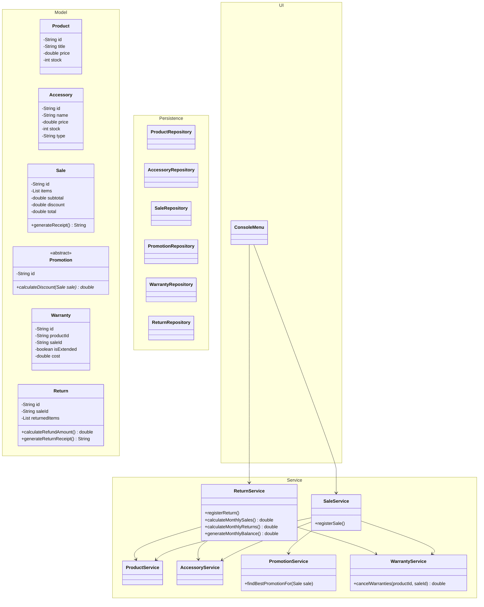

# Integrated System Class Diagram

```mermaid
classDiagram
    %% Layer 1: Model
    namespace Model {
        class Product {
            -String id
            -String title
            -double price
            -int stock
        }
        class Accessory {
            -String id
            -String name
            -double price
            -int stock
            -String type
        }
        class Sale {
            -String id
            -List items
            -double subtotal
            -double discount
            -double total
            +generateReceipt() String
        }
        class Promotion {
            <<abstract>>
            -String id
            +calculateDiscount(Sale sale)* double
        }
        class Warranty {
            -String id
            -String productId
            -String saleId
            -boolean isExtended
            -double cost
        }
        class Return {
            -String id
            -String saleId
            -List returnedItems
            +calculateRefundAmount() double
            +generateReturnReceipt() String
        }
    }

    %% Layer 2: Persistence
    namespace Persistence {
        class ProductRepository
        class AccessoryRepository
        class SaleRepository
        class PromotionRepository
        class WarrantyRepository
        class ReturnRepository
    }

    %% Layer 3: Service
    namespace Service {
        class ProductService
        class AccessoryService
        class SaleService {
            +registerSale()
        }
        class PromotionService {
            +findBestPromotionFor(Sale sale)
        }
        class WarrantyService {
            +cancelWarranties(productId, saleId) double
        }
        class ReturnService {
            +registerReturn()
            +calculateMonthlySales() double
            +calculateMonthlyReturns() double
            +generateMonthlyBalance() double
        }
    }

    %% Layer 4: UI
    namespace UI {
        class ConsoleMenu
    }

    %% Relationships
    ConsoleMenu --> SaleService
    ConsoleMenu --> ReturnService
    SaleService --> ProductService
    SaleService --> AccessoryService
    SaleService --> PromotionService
    SaleService --> WarrantyService
    ReturnService --> WarrantyService
    ReturnService --> AccessoryService
    ReturnService --> ProductService
```
