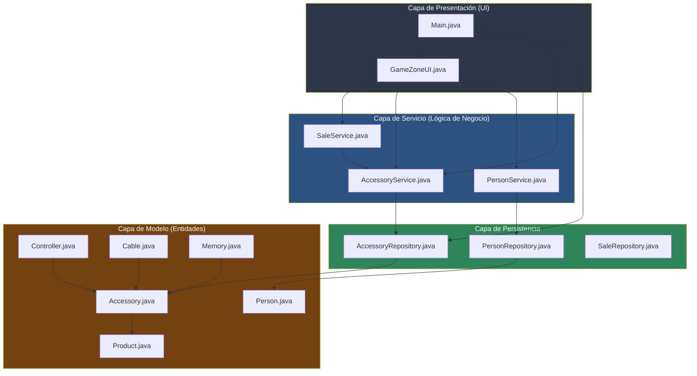

# Arquitectura por Capas - GameZone Unicesar

## Descripción de capas

- **UI:** interactúa con el usuario y delega en los servicios.
- **Service:** contiene la lógica de negocio (validaciones, reglas de registro).
- **Persistence:** se encarga de guardar y leer datos (archivos CSV).
- **Model:** representa las entidades del dominio. `Controller`, `Cable` y `Memory` heredan de `Accessory`, que a su vez hereda de `Product`.
