# Arquitectura por Capas - GameZone Unicesar

```mermaid
graph TD
    subgraph UI["Capa de Presentacion (UI)"]
        GameZoneUI[GameZoneUI.java]
        MainClass[Main.java]
    end

    subgraph Service["Capa de Servicio (Logica de Negocio)"]
        SaleService[SaleService.java]
        AccessoryService[AccessoryService.java]
        PersonService[PersonService.java]
        PromotionService[PromotionService.java]
        ReturnService[ReturnService.java]
        WarrantyService[WarrantyService.java]
    end

    subgraph Persistence["Capa de Persistencia"]
        AccessoryRepository[AccessoryRepository.java]
        PersonRepository[PersonRepository.java]
        SaleRepository[SaleRepository.java]
        PromotionRepository[PromotionRepository.java]
        ReturnRepository[ReturnRepository.java]
        WarrantyRepository[WarrantyRepository.java]
    end

    subgraph Model["Capa de Modelo (Entidades)"]
        Product[Product.java]
        Accessory[Accessory.java]
        Controller[Controller.java]
        Cable[Cable.java]
        Memory[Memory.java]
        Person[Person.java]
        Sale[Sale.java]
        Promotion[Promotion.java]
        PercentageDiscount[PercentageDiscount.java]
        CategoryDiscount[CategoryDiscount.java]
        BulkPurchaseDiscount[BulkPurchaseDiscount.java]
        Return[Return.java]
        Warranty[Warranty.java]
        BasicWarranty[BasicWarranty.java]
        ExtendedWarranty[ExtendedWarranty.java]
    end

    MainClass --> GameZoneUI
    MainClass --> AccessoryService
    MainClass --> AccessoryRepository

    GameZoneUI --> SaleService
    GameZoneUI --> AccessoryService
    GameZoneUI --> PersonService
    GameZoneUI --> PromotionService
    GameZoneUI --> ReturnService
    GameZoneUI --> WarrantyService

    SaleService --> AccessoryService
    SaleService --> PromotionService
    SaleService --> WarrantyService

    AccessoryService --> AccessoryRepository
    PersonService --> PersonRepository
    PromotionService --> PromotionRepository
    ReturnService --> ReturnRepository
    ReturnService --> SaleService
    ReturnService --> ProductService
    WarrantyService --> WarrantyRepository
    WarrantyRepository --> SaleService
    WarrantyRepository --> ProductService

    AccessoryRepository --> Accessory
    PersonRepository --> Person
    PromotionRepository --> Promotion
    ReturnRepository --> Return
    WarrantyRepository --> Warranty

    Controller --> Accessory
    Cable --> Accessory
    Memory --> Accessory
    Accessory --> Product

    PercentageDiscount --> Promotion
    CategoryDiscount --> Promotion
    BulkPurchaseDiscount --> Promotion

    BasicWarranty --> Warranty
    ExtendedWarranty --> Warranty

    Return --> Sale
    Warranty --> Sale
    Warranty --> Product

    PromotionService -.->|calculateDiscount| Sale
    CategoryDiscount -.->|filters by type| Product
    SaleService -.->|applies best promotion| Sale
    ReturnService -.->|restoreStock| ProductService
    ReturnService -.->|canBeReturned| Sale
    SaleService -.->|assignBasicWarranty for Console| WarrantyService
    SaleService -.->|assignExtendedWarranty on request| WarrantyService

    style UI fill:#2d3748,color:#fff
    style Service fill:#2c5282,color:#fff
    style Persistence fill:#2f855a,color:#fff
    style Model fill:#744210,color:#fff
```

## Descripcion de capas

- **UI:** interactua con el usuario y delega en los servicios.
- **Service:** contiene la logica de negocio (validaciones, reglas de registro, seleccion de la mejor promocion, procesamiento de devoluciones, asignacion de garantias).
- **Persistence:** se encarga de guardar y leer datos (archivos CSV).
- **Model:** representa las entidades del dominio. Controller, Cable y Memory heredan de Accessory, que a su vez hereda de Product. PercentageDiscount, CategoryDiscount y BulkPurchaseDiscount heredan de la clase abstracta Promotion. BasicWarranty y ExtendedWarranty heredan de la clase abstracta Warranty. Return y Warranty hacen referencia a Sale (asociacion, no herencia).

## Modulo de Promociones

- PromotionRepository persiste todas las promociones en data/promotions.csv usando un discriminador de tipo (PERCENTAGE, CATEGORY, BULK).
- PromotionService implementa el registro de cada tipo de promocion, el listado de promociones vigentes, y la logica de seleccion de la mejor promocion aplicable a una venta (findBestPromotionFor).
- SaleService.registerSale invoca PromotionService.findBestPromotionFor(sale) al registrar una venta, y si retorna una promocion, aplica su descuento al total de la venta.
- CategoryDiscount.calculateDiscount depende de Product (mediante instanceof VideoGame / instanceof Console) para filtrar los productos de la categoria objetivo.

## Modulo de Devoluciones

- ReturnRepository persiste todas las devoluciones en data/returns.csv, e inyecta SaleService y ProductService para resolver las referencias a Sale y Product durante la carga.
- ReturnService implementa el registro de una devolucion (registerReturn), validando que la venta exista, que este dentro del plazo de 30 dias (Sale.canBeReturned()) y que los productos indicados pertenezcan efectivamente a la venta original.
- Al registrar una devolucion exitosa, ReturnService invoca ProductService.restoreStock() para reintegrar el stock de los productos devueltos, reutilizando la logica existente en lugar de duplicarla.
- ReturnService tambien implementa las consultas viewAllReturns, viewReturnsByCustomer y viewReturnsBySale, y el reporte generateMonthlyBalance, que consolida el total de ventas y devoluciones de un mes y ano especificos.

## Modulo de Garantias (nuevo)

- WarrantyRepository persiste todas las garantias en data/warranties.csv usando un discriminador de tipo (BASIC, EXTENDED), e inyecta SaleService y ProductService para resolver las referencias a Sale y Product durante la carga.
- WarrantyService implementa assignBasicWarranty y assignExtendedWarranty (creacion y persistencia), findWarrantyByProduct, listAllWarranties, listActiveWarranties y listWarrantiesExpiringSoon.
- Warranty es abstracta y calcula automaticamente su fecha de vencimiento en el constructor, invocando el metodo abstracto getDurationInMonths() implementado por BasicWarranty (6 meses, sin costo) y ExtendedWarranty (12 meses, costo del 10% del precio del producto).
- SaleService.registerSale debe invocar WarrantyService.assignBasicWarranty automaticamente para cada Console incluida en la venta, y WarrantyService.assignExtendedWarranty cuando el vendedor lo solicite explicitamente, sumando su costo adicional al total de la venta.
