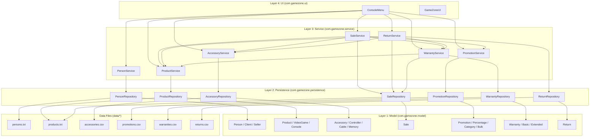

# Arquitectura por Capas - GameZone Unicesar

```mermaid
graph TD
    %% Layer 4: UI
    subgraph UI["Layer 4: UI (com.gamezone.ui)"]
        ConsoleMenu["ConsoleMenu"]
        GameZoneUI["GameZoneUI"]
    end

    %% Layer 3: Service
    subgraph Service["Layer 3: Service (com.gamezone.service)"]
        PersonService["PersonService"]
        ProductService["ProductService"]
        AccessoryService["AccessoryService"]
        SaleService["SaleService"]
        PromotionService["PromotionService"]
        WarrantyService["WarrantyService"]
        ReturnService["ReturnService"]
    end

    %% Layer 2: Persistence
    subgraph Persistence["Layer 2: Persistence (com.gamezone.persistence)"]
        PersonRepository["PersonRepository"]
        ProductRepository["ProductRepository"]
        AccessoryRepository["AccessoryRepository"]
        SaleRepository["SaleRepository"]
        PromotionRepository["PromotionRepository"]
        WarrantyRepository["WarrantyRepository"]
        ReturnRepository["ReturnRepository"]
    end

    %% Layer 1: Model
    subgraph Model["Layer 1: Model (com.gamezone.model)"]
        Person["Person / Client / Seller"]
        Product["Product / VideoGame / Console"]
        Accessory["Accessory / Controller / Cable / Memory"]
        Sale["Sale"]
        Promotion["Promotion / Percentage / Category / Bulk"]
        Warranty["Warranty / Basic / Extended"]
        Return["Return"]
    end

    %% Data Storage
    subgraph Data["Data Files (data/*)"]
        PersonsFile["persons.txt"]
        ProductsFile["products.txt"]
        AccessoriesFile["accessories.csv"]
        PromotionsFile["promotions.csv"]
        WarrantiesFile["warranties.csv"]
        ReturnsFile["returns.csv"]
    end

    %% Strictly Enforced Layer Dependencies (UI -> Service -> Persistence -> Model)
    ConsoleMenu --> SaleService
    ConsoleMenu --> ProductService
    ConsoleMenu --> AccessoryService
    ConsoleMenu --> PromotionService
    ConsoleMenu --> WarrantyService
    ConsoleMenu --> ReturnService
    ConsoleMenu --> PersonService

    SaleService --> ProductService
    SaleService --> AccessoryService
    SaleService --> PromotionService
    SaleService --> WarrantyService
    SaleService --> SaleRepository

    ReturnService --> ProductService
    ReturnService --> AccessoryService
    ReturnService --> WarrantyService
    ReturnService --> ReturnRepository
    ReturnService --> SaleRepository

    WarrantyService --> WarrantyRepository
    WarrantyService --> SaleRepository
    WarrantyService --> ProductService

    PromotionService --> PromotionRepository
    ProductService --> ProductRepository
    AccessoryService --> AccessoryRepository
    PersonService --> PersonRepository

    PersonRepository --> PersonsFile
    ProductRepository --> ProductsFile
    AccessoryRepository --> AccessoriesFile
    SaleRepository --> ProductsFile
    PromotionRepository --> PromotionsFile
    WarrantyRepository --> WarrantiesFile
    ReturnRepository --> ReturnsFile

    PersonRepository --> Person
    ProductRepository --> Product
    AccessoryRepository --> Accessory
    SaleRepository --> Sale
    PromotionRepository --> Promotion
    WarrantyRepository --> Warranty
    ReturnRepository --> Return
```
