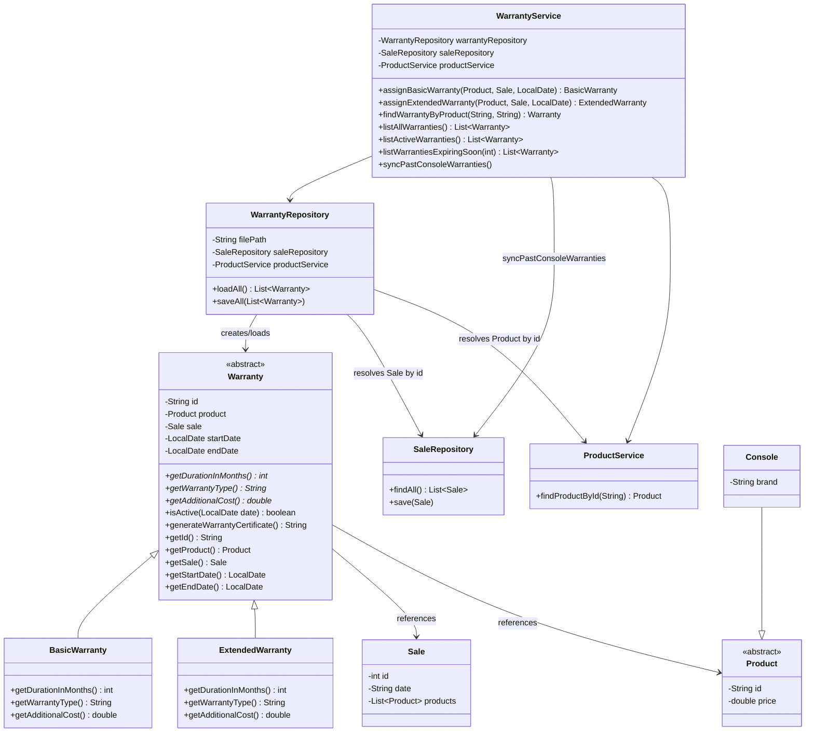

# Diagrama de Clases - Modulo de Garantias

## Descripcion

- `Warranty` es una clase abstracta con dos subclases concretas: `BasicWarranty` (6 meses, sin costo) y `ExtendedWarranty` (12 meses, costo del 10% del precio del producto). La fecha de vencimiento se calcula automaticamente en el constructor de `Warranty`, invocando el metodo abstracto `getDurationInMonths()`.

- **Correccion aplicada en el ajuste A2 (fix/warranty-circular-dependency):** la especificacion original del Requerimiento 4 generaba un ciclo `SaleService -> WarrantyService -> WarrantyRepository -> SaleService`, ya que `WarrantyRepository` necesitaba `SaleService` para resolver referencias a `Sale` durante la carga, y `SaleService` necesitaba `WarrantyService` para asignar garantias automaticas al registrar una venta. Esto impedia construir los objetos en `Main` mediante inyeccion simple por constructor, y obligaba a un parche temporal (construir `SaleService` dos veces).

- **Solucion:** `WarrantyRepository` y `WarrantyService` ahora dependen de `SaleRepository` (no de `SaleService`) para resolver las referencias a `Sale`. Como `SaleRepository` no depende de ningun servicio relacionado con garantias, el ciclo desaparece. El orden de construccion en `Main` queda: `SaleRepository` -> `WarrantyRepository`/`WarrantyService` -> `SaleService` (que si depende de `WarrantyService` para asignar garantias automaticas al registrar ventas).

- `WarrantyService.syncPastConsoleWarranties()` ya no recibe `SaleService` como parametro; usa directamente el `SaleRepository` inyectado por constructor para recorrer las ventas historicas y generar garantias basicas retroactivas para consolas que aun no las tengan.
